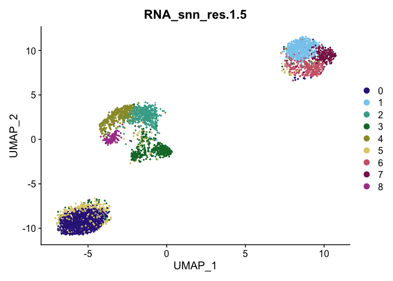

We begin by loading required packages.


```r
library(Seurat)
```

```
## Attaching SeuratObject
```

```r
library(ggplot2)
library(velocyto.R)
```

```
## Loading required package: Matrix
```

```r
#install.packages("devtools")
#remotes::install_github('satijalab/seurat-wrappers')
library(SeuratWrappers)
```

I prefer to use a few custom colorblind-friendly palettes, so we will set those up now. The palettes used in this exercise were developed by Paul Tol. You can learn more about them on [Tol's webpage](https://personal.sron.nl/~pault/#sec:qualitative).


```r
tol_high_contrast_palette <- c("#DDAA33", "#BB5566", "#004488")
tol_vibrant_palette <- c("#0077BB", "#33BBEE", "#009988",
                         "#EE7733", "#CC3311", "#EE3377",
                         "#BBBBBB")
tol_muted_palette <- c("#332288", "#88CCEE", "#44AA99",
                       "#117733", "#999933", "#DDCC77",
                       "#CC6677", "#882255", "#AA4499")
```

## Project set-up

For completeness, we will run the count data through a basic Seurat analysis before we load in the loom files for our velocity analysis. For greater detail on single cell RNA-Seq analysis, see the course materials [here](https://ucdavis-bioinformatics-training.github.io/2021-August-Single-Cell-RNA-Seq-Analysis/).

### Seurat

If you are in a hurry, you can skip this section, and filter the cells loaded in from the loom file instead in the Velocyto section. You will not be able to execute the code as is, and will need to make a few changes.


```r
data_location <- "data/"
samples <- c("sample1", "sample2", "sample3")

raw10x <- lapply(samples, function(i){
  d10x <- Read10X_h5(file.path(data_location, paste0(i, "_raw_feature_bc_matrix.h5")))
  colnames(d10x$`Gene Expression`) <- paste(sapply(strsplit(colnames(d10x$`Gene Expression`),split="-"),'[[',1L),i,sep="-")
  colnames(d10x$`Antibody Capture`) <- paste(sapply(strsplit(colnames(d10x$`Antibody Capture`),split="-"),'[[',1L),i,sep="-")
  d10x
})
```

```
## Warning in sparseMatrix(i = indices[] + 1, p = indptr[], x = as.numeric(x =
## counts[]), : 'giveCsparse' has been deprecated; setting 'repr = "T"' for you
```

```
## Genome matrix has multiple modalities, returning a list of matrices for this genome
```

```
## Warning in sparseMatrix(i = indices[] + 1, p = indptr[], x = as.numeric(x =
## counts[]), : 'giveCsparse' has been deprecated; setting 'repr = "T"' for you
```

```
## Genome matrix has multiple modalities, returning a list of matrices for this genome
```

```
## Warning in sparseMatrix(i = indices[] + 1, p = indptr[], x = as.numeric(x =
## counts[]), : 'giveCsparse' has been deprecated; setting 'repr = "T"' for you
```

```
## Genome matrix has multiple modalities, returning a list of matrices for this genome
```

```r
names(raw10x) <- samples
gex <- CreateSeuratObject(do.call("cbind", lapply(raw10x,"[[", "Gene Expression")),
                          project = "cellranger multi",
                          min.cells = 0,
                          min.features = 300,
                          names.field = 2,
                          names.delim = "\\-")
gex$percent_mito <- PercentageFeatureSet(gex, pattern = "^MT-")

FeatureScatter(gex,
               feature1 = "nCount_RNA",
               feature2 = "percent_mito",
               shuffle = TRUE) +
  geom_vline(xintercept = 10000) +
  geom_hline(yintercept = 10) +
  scale_color_manual(values = tol_high_contrast_palette)
```

<!-- -->

```r
FeatureScatter(gex,
               feature1 = "nFeature_RNA",
               feature2 = "percent_mito",
               shuffle = TRUE) +
  geom_vline(xintercept = 2500) +
  geom_hline(yintercept = 10) +
  scale_color_manual(values = tol_high_contrast_palette)
```

<!-- -->

```r
FeatureScatter(gex,
               feature1 = "nCount_RNA",
               feature2 = "nFeature_RNA",
               shuffle = TRUE) +
  geom_vline(xintercept = 10000) +
  geom_hline(yintercept = 2500) +
  scale_color_manual(values = tol_high_contrast_palette)
```

<!-- -->

```r
gex <- subset(gex, percent_mito <= 10)
gex <- subset(gex, nCount_RNA <= 10000)
gex <- subset(gex, nFeature_RNA >= 500)
table(gex$orig.ident)
```

```
##
## sample1 sample2 sample3
##    1855     999    1200
```

```r
gex <- NormalizeData(object = gex,
                     normalization.method = "LogNormalize",
                     scale.factor = 10000)

gex <- CellCycleScoring(object = gex,
                        s.features = cc.genes$s.genes,
                        g2m.features = cc.genes$g2m.genes,
                        set.ident = FALSE)
```

```
## Warning: The following features are not present in the object: MLF1IP, not
## searching for symbol synonyms
```

```
## Warning: The following features are not present in the object: FAM64A, HN1, not
## searching for symbol synonyms
```

```r
gex <- ScaleData(object = gex,
                 vars.to.regress = c("S.Score",
                                     "G2M.Score",
                                     "percent_mito",
                                     "nFeature_RNA"))
```

```
## Regressing out S.Score, G2M.Score, percent_mito, nFeature_RNA
```

```
## Centering and scaling data matrix
```

```r
gex <- RunPCA(object = gex,
              npcs = 100,
              features = rownames(gex),
              verbose = FALSE)
DimPlot(object = gex,
        reduction = "pca",
        group.by = "orig.ident",
        shuffle = TRUE) +
  scale_color_manual(values = tol_high_contrast_palette)
```

<!-- -->

```r
gex <- FindNeighbors(object = gex,
                     reduction = "pca",
                     dims = c(1:50),
                     verbose = FALSE)
gex <- FindClusters(object = gex,
                    resolution = seq(0.25, 2, 0.25),
                    verbose = FALSE)
sapply(grep("res", colnames(gex@meta.data), value = TRUE),
       function(x) {length(unique(gex@meta.data[,x]))})
```

```
## RNA_snn_res.0.25  RNA_snn_res.0.5 RNA_snn_res.0.75    RNA_snn_res.1
##                4                6                6                7
## RNA_snn_res.1.25  RNA_snn_res.1.5 RNA_snn_res.1.75    RNA_snn_res.2
##                9                9               12               12
```

```r
gex <- RunUMAP(object = gex,
               reduction = "pca",
               dims = c(1:50),
               verbose = FALSE)
```

```
## Warning: The default method for RunUMAP has changed from calling Python UMAP via reticulate to the R-native UWOT using the cosine metric
## To use Python UMAP via reticulate, set umap.method to 'umap-learn' and metric to 'correlation'
## This message will be shown once per session
```

```r
DimPlot(object = gex,
        reduction = "umap",
        group.by = "RNA_snn_res.1.5",
        ncol = 2,
        shuffle = TRUE) +
  scale_color_manual(values = tol_muted_palette)
```

<!-- -->

# Velocyto

## Read in loom files


```r
reformatLoomColnames <- function(loomObject, assay, id){
  paste(substr(colnames(loomObject[[assay]]), 25, 40), id, sep = "-")
}

loom_data <- lapply(samples, function(sample_id){
  loom_object <- ReadVelocity(file.path(data_location,
                                        paste0(sample_id, ".loom")))
  colnames(loom_object$spliced) <- reformatLoomColnames(
    loomObject = loom_object,
    assay = "spliced",
    id = sample_id)
  colnames(loom_object$unspliced) <- reformatLoomColnames(
    loomObject = loom_object,
    assay = "unspliced",
    id = sample_id)
  colnames(loom_object$ambiguous) <- reformatLoomColnames(
    loomObject = loom_object,
    assay = "ambiguous",
    id = sample_id)
  loom_object
})
names(loom_data) <- samples

loom_aggregate <- lapply(c("spliced", "unspliced"), function(assay){
  do.call("cbind", lapply(loom_data,"[[", assay))
})
names(loom_aggregate) <- c("spliced", "unspliced")
loom_seurat <- CreateSeuratObject(counts = loom_aggregate$spliced,
                          project = "Advanced Topics Workshop",
                          assay = "spliced",
                          min.cells = 0,
                          min.features = 0,
                          names.field = 2,
                          names.delim = "\\-")
```

```
## Warning: Non-unique features (rownames) present in the input matrix, making
## unique
```

```r
loom_seurat[["unspliced"]] <- CreateAssayObject(counts = loom_aggregate$unspliced)
```

```
## Warning: Non-unique features (rownames) present in the input matrix, making
## unique
```

## Select cells used in gene expression analysis

If you did not run the initial Seurat section, this is where you would change the code to subset your cells in some other way, or simply use all cells.


```r
loom_seurat_filtered <- loom_seurat[rownames(gex), colnames(gex)]
```

## Run Seurat


```r
loom_seurat_filtered <- NormalizeData(loom_seurat_filtered,
                                      verbose = FALSE)
loom_seurat_filtered <- ScaleData(loom_seurat_filtered,
                                  verbose = FALSE)
loom_seurat_filtered <- RunPCA(loom_seurat_filtered,
                               features = rownames(loom_seurat_filtered),
                               verbose = FALSE)
loom_seurat_filtered <- FindNeighbors(loom_seurat_filtered,
                                      dims = 1:50,
                                      verbose = FALSE)
loom_seurat_filtered <- FindClusters(loom_seurat_filtered,
                                     verbose = FALSE)
loom_seurat_filtered <- RunUMAP(loom_seurat_filtered,
                                dims = 1:50,
                                verbose = FALSE)
```

## Run velocity analysis

Finally we can run the velocity analysis!


```r
loom_seurat_filtered <- RunVelocity(loom_seurat_filtered,
                           deltaT = 1,
                           kCells = 25,
                           fit.quantile = 0.02,
                           verbose = FALSE)

ident_colors <- tol_vibrant_palette
names(ident_colors) <- levels(loom_seurat_filtered)
cell_colors <- ident_colors[Idents(loom_seurat_filtered)]
names(cell_colors) <- colnames(loom_seurat_filtered)
show.velocity.on.embedding.cor(emb = Embeddings(loom_seurat_filtered,
                                                reduction = "umap"),
                               vel = Tool(loom_seurat_filtered,
                                          slot = "RunVelocity"),
                               n = 200,
                               scale = "sqrt",
                               cell.colors = ac(x = cell_colors, alpha = 0.5),
                               cex = 0.8,
                               arrow.scale = 3,
                               show.grid.flow = TRUE,
                               min.grid.cell.mass = 0.5,
                               grid.n = 40,
                               arrow.lwd = 1,
                               do.par = FALSE,
                               cell.border.alpha = 0.1)
```

<!-- -->

```
## delta projections ... sqrt knn ... transition probs ... done
## calculating arrows ... done
## grid estimates ... grid.sd= 0.1901814  min.arrow.size= 0.003803628  max.grid.arrow.length= 0.04106169  done
```

In this plot, the cells are colored by the clusters calculated on the loom data. These clusters are *not* identical to the clusters we calculated in our initial Seurat analysis on the total count data.

We can examine the relationship between the two sets of clusters, and even use the cluster identities from our initial Seurat analysis to visualize those clusters instead.


```r
loom_seurat_filtered <- AddMetaData(object = loom_seurat_filtered,
                                    metadata = gex$RNA_snn_res.1.5,
                                    col.name = "gex.clusters")
table(loom_seurat_filtered$gex.clusters,
      loom_seurat_filtered$spliced_snn_res.0.8)
```

```
##    
##        0    1    2    3    4    5
##   0 1076    0    0   12    2    3
##   1    0    6  468  124    1    1
##   2    3  447    1    1    6   22
##   3   30   24    0    5  370   15
##   4    3  211    5    4    4  171
##   5  292    3    1   36   15    3
##   6    0    0   11  276    0    0
##   7    0    4  164   48    0    0
##   8    0    2    0    4    0  140
```

```r
ident_colors2 <- tol_muted_palette
names(ident_colors2) <- levels(loom_seurat_filtered$gex.clusters)
cell_colors2 <- ident_colors2[loom_seurat_filtered$gex.clusters]
names(cell_colors2) <- colnames(loom_seurat_filtered)

show.velocity.on.embedding.cor(emb = Embeddings(loom_seurat_filtered,
                                                reduction = "umap"),
                               vel = Tool(loom_seurat_filtered,
                                          slot = "RunVelocity"),
                               n = 200,
                               scale = "sqrt",
                               cell.colors = ac(x = cell_colors2,
                                                alpha = 0.5),
                               cex = 0.8,
                               arrow.scale = 3,
                               show.grid.flow = TRUE,
                               min.grid.cell.mass = 0.5,
                               grid.n = 40,
                               arrow.lwd = 1,
                               do.par = FALSE,
                               cell.border.alpha = 0.1)
```

<!-- -->

```
## delta projections ... sqrt knn ... transition probs ... done
## calculating arrows ... done
## grid estimates ... grid.sd= 0.1901814  min.arrow.size= 0.003803628  max.grid.arrow.length= 0.04106169  done
```


## Session Information


```r
sessionInfo()
```

```
## R version 4.0.3 (2020-10-10)
## Platform: x86_64-apple-darwin17.0 (64-bit)
## Running under: macOS Big Sur 10.16
##
## Matrix products: default
## BLAS:   /Library/Frameworks/R.framework/Versions/4.0/Resources/lib/libRblas.dylib
## LAPACK: /Library/Frameworks/R.framework/Versions/4.0/Resources/lib/libRlapack.dylib
##
## locale:
## [1] en_US.UTF-8/en_US.UTF-8/en_US.UTF-8/C/en_US.UTF-8/en_US.UTF-8
##
## attached base packages:
## [1] stats     graphics  grDevices utils     datasets  methods   base     
##
## other attached packages:
## [1] SeuratWrappers_0.3.0 velocyto.R_0.6       Matrix_1.3-4        
## [4] ggplot2_3.3.5        SeuratObject_4.0.2   Seurat_4.0.3        
##
## loaded via a namespace (and not attached):
##   [1] Rtsne_0.15            colorspace_2.0-2      deldir_0.2-10        
##   [4] ellipsis_0.3.2        ggridges_0.5.3        spatstat.data_2.1-0  
##   [7] farver_2.1.0          leiden_0.3.9          listenv_0.8.0        
##  [10] remotes_2.4.0         bit64_4.0.5           ggrepel_0.9.1        
##  [13] RSpectra_0.16-0       fansi_0.5.0           R.methodsS3_1.8.1    
##  [16] codetools_0.2-18      splines_4.0.3         knitr_1.33           
##  [19] polyclip_1.10-0       jsonlite_1.7.2        ica_1.0-2            
##  [22] cluster_2.1.2         R.oo_1.24.0           png_0.1-7            
##  [25] uwot_0.1.10           shiny_1.6.0           sctransform_0.3.2    
##  [28] spatstat.sparse_2.0-0 BiocManager_1.30.16   compiler_4.0.3       
##  [31] httr_1.4.2            assertthat_0.2.1      fastmap_1.1.0        
##  [34] lazyeval_0.2.2        later_1.3.0           htmltools_0.5.1.1    
##  [37] tools_4.0.3           rsvd_1.0.5            igraph_1.2.6         
##  [40] gtable_0.3.0          glue_1.4.2            RANN_2.6.1           
##  [43] reshape2_1.4.4        dplyr_1.0.7           Rcpp_1.0.7           
##  [46] Biobase_2.50.0        scattermore_0.7       jquerylib_0.1.4      
##  [49] vctrs_0.3.8           nlme_3.1-152          lmtest_0.9-38        
##  [52] xfun_0.25             stringr_1.4.0         globals_0.14.0       
##  [55] mime_0.11             miniUI_0.1.1.1        lifecycle_1.0.0      
##  [58] irlba_2.3.3           goftest_1.2-2         future_1.21.0        
##  [61] MASS_7.3-54           zoo_1.8-9             scales_1.1.1         
##  [64] spatstat.core_2.3-0   pcaMethods_1.80.0     promises_1.2.0.1     
##  [67] spatstat.utils_2.2-0  parallel_4.0.3        RColorBrewer_1.1-2   
##  [70] yaml_2.2.1            reticulate_1.20       pbapply_1.4-3        
##  [73] gridExtra_2.3         sass_0.4.0            rpart_4.1-15         
##  [76] stringi_1.7.3         highr_0.9             BiocGenerics_0.36.0  
##  [79] rlang_0.4.11          pkgconfig_2.0.3       matrixStats_0.60.0   
##  [82] evaluate_0.14         lattice_0.20-44       ROCR_1.0-11          
##  [85] purrr_0.3.4           tensor_1.5            labeling_0.4.2       
##  [88] patchwork_1.1.1       htmlwidgets_1.5.3     bit_4.0.4            
##  [91] cowplot_1.1.1         tidyselect_1.1.1      parallelly_1.27.0    
##  [94] RcppAnnoy_0.0.19      plyr_1.8.6            magrittr_2.0.1       
##  [97] R6_2.5.0              generics_0.1.0        DBI_1.1.1            
## [100] pillar_1.6.2          withr_2.4.2           mgcv_1.8-36          
## [103] fitdistrplus_1.1-5    survival_3.2-11       abind_1.4-5          
## [106] tibble_3.1.3          future.apply_1.8.1    hdf5r_1.3.2          
## [109] crayon_1.4.1          KernSmooth_2.23-20    utf8_1.2.2           
## [112] spatstat.geom_2.2-2   plotly_4.9.4.1        rmarkdown_2.10       
## [115] grid_4.0.3            data.table_1.14.0     digest_0.6.27        
## [118] xtable_1.8-4          tidyr_1.1.3           httpuv_1.6.2         
## [121] R.utils_2.10.1        munsell_0.5.0         viridisLite_0.4.0    
## [124] bslib_0.2.5.1
```
