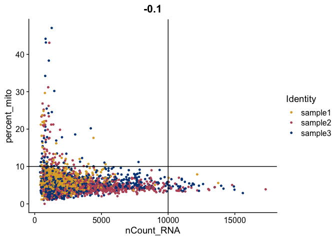
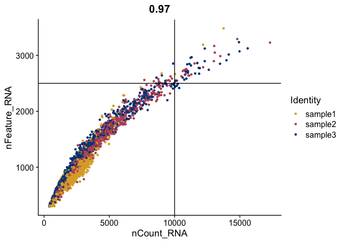

For a non-Rmd version of this code, [download the Velocyto.R script](https://raw.githubusercontent.com/ucdavis-bioinformatics-training/2021-August-Advanced-Topics-in-Single-Cell-RNA-Seq-Trajectory-and-Velocity/master/data_analysis/Velocyto.R).

## Project set-up

We begin by loading required packages.


```r
library(Seurat)
```

<div class='r_output'> Attaching SeuratObject
</div>
```r
library(ggplot2)
library(velocyto.R)
```

<div class='r_output'> Loading required package: Matrix
</div>
```r
library(SeuratWrappers)
```

And storing the location and names of the input data.


```r
data_location <- "data_download/"
samples <- c("sample1", "sample2", "sample3")
```

I prefer to use a few custom colorblind-friendly palettes, so we will set those up now. The palettes used in this exercise were developed by Paul Tol. You can learn more about them on [Tol's webpage](https://personal.sron.nl/~pault/#sec:qualitative).


```r
tol_high_contrast_palette <- c("#DDAA33", "#BB5566", "#004488")
tol_vibrant_palette <- c("#0077BB", "#33BBEE", "#009988",
                         "#EE7733", "#CC3311", "#EE3377",
                         "#BBBBBB")
tol_muted_palette <- c("#332288", "#88CCEE", "#44AA99",
                       "#117733", "#999933", "#DDCC77",
                       "#CC6677", "#882255", "#AA4499")
```

### Seurat

For completeness, and to practice integrating existing analyses with our velocyto analysis, we will run the cellranger count output through a basic Seurat analysis, creating a separate Seurat object, before we load in the loom files and begin our velocity analysis. For greater detail on single cell RNA-Seq analysis, see the course materials [here](https://ucdavis-bioinformatics-training.github.io/2021-August-Single-Cell-RNA-Seq-Analysis/).

The material in this section is **not required to run the velocity analysis**. We will be integrating this standard single cell RNA-Seq experiment with our velocity analysis in the third section. If you are in a hurry, you can skip this section. If you do so, you will need to make a few changes to the code in the Velocyto section, and, of course, you will not be able to execute the section on integrating the two analyses.


```r
raw10x <- lapply(samples, function(i){
  d10x <- Read10X_h5(file.path(data_location, paste0(i, "_raw_feature_bc_matrix.h5")))
  colnames(d10x$`Gene Expression`) <- paste(sapply(strsplit(colnames(d10x$`Gene Expression`),split="-"),'[[',1L),i,sep="-")
  colnames(d10x$`Antibody Capture`) <- paste(sapply(strsplit(colnames(d10x$`Antibody Capture`),split="-"),'[[',1L),i,sep="-")
  d10x
})
```

<div class='r_output'> Warning in sparseMatrix(i = indices[] + 1, p = indptr[], x = as.numeric(x =
 counts[]), : 'giveCsparse' has been deprecated; setting 'repr = "T"' for you
</div>
<div class='r_output'> Genome matrix has multiple modalities, returning a list of matrices for this genome
</div>
<div class='r_output'> Warning in sparseMatrix(i = indices[] + 1, p = indptr[], x = as.numeric(x =
 counts[]), : 'giveCsparse' has been deprecated; setting 'repr = "T"' for you
</div>
<div class='r_output'> Genome matrix has multiple modalities, returning a list of matrices for this genome
</div>
<div class='r_output'> Warning in sparseMatrix(i = indices[] + 1, p = indptr[], x = as.numeric(x =
 counts[]), : 'giveCsparse' has been deprecated; setting 'repr = "T"' for you
</div>
<div class='r_output'> Genome matrix has multiple modalities, returning a list of matrices for this genome
</div>
```r
names(raw10x) <- samples
gex <- CreateSeuratObject(do.call("cbind", lapply(raw10x,"[[", "Gene Expression")),
                          project = "cellranger multi",
                          min.cells = 0,
                          min.features = 300,
                          names.field = 2,
                          names.delim = "\\-")
gex$percent_mito <- PercentageFeatureSet(gex, pattern = "^MT-")

FeatureScatter(gex,
               feature1 = "nCount_RNA",
               feature2 = "percent_mito",
               shuffle = TRUE) +
  geom_vline(xintercept = 10000) +
  geom_hline(yintercept = 10) +
  scale_color_manual(values = tol_high_contrast_palette)
```

<!-- -->

```r
FeatureScatter(gex,
               feature1 = "nFeature_RNA",
               feature2 = "percent_mito",
               shuffle = TRUE) +
  geom_vline(xintercept = 2500) +
  geom_hline(yintercept = 10) +
  scale_color_manual(values = tol_high_contrast_palette)
```

<!-- -->

```r
FeatureScatter(gex,
               feature1 = "nCount_RNA",
               feature2 = "nFeature_RNA",
               shuffle = TRUE) +
  geom_vline(xintercept = 10000) +
  geom_hline(yintercept = 2500) +
  scale_color_manual(values = tol_high_contrast_palette)
```

<!-- -->

```r
gex <- subset(gex, percent_mito <= 10)
gex <- subset(gex, nCount_RNA <= 10000)
gex <- subset(gex, nFeature_RNA >= 500)
table(gex$orig.ident)
```

<div class='r_output'>
 sample1 sample2 sample3
    1855     999    1200
</div>
```r
gex <- NormalizeData(object = gex,
                     normalization.method = "LogNormalize",
                     scale.factor = 10000)

gex <- CellCycleScoring(object = gex,
                        s.features = cc.genes$s.genes,
                        g2m.features = cc.genes$g2m.genes,
                        set.ident = FALSE)
```

<div class='r_output'> Warning: The following features are not present in the object: MLF1IP, not
 searching for symbol synonyms
</div>
<div class='r_output'> Warning: The following features are not present in the object: FAM64A, HN1, not
 searching for symbol synonyms
</div>
```r
gex <- ScaleData(object = gex,
                 vars.to.regress = c("S.Score",
                                     "G2M.Score",
                                     "percent_mito",
                                     "nFeature_RNA"))
```

<div class='r_output'> Regressing out S.Score, G2M.Score, percent_mito, nFeature_RNA
</div>
<div class='r_output'> Centering and scaling data matrix
</div>
```r
gex <- RunPCA(object = gex,
              npcs = 100,
              features = rownames(gex),
              verbose = FALSE)
DimPlot(object = gex,
        reduction = "pca",
        group.by = "orig.ident",
        shuffle = TRUE) +
  scale_color_manual(values = tol_high_contrast_palette)
```

<!-- -->

```r
gex <- FindNeighbors(object = gex,
                     reduction = "pca",
                     dims = c(1:50),
                     verbose = FALSE)
gex <- FindClusters(object = gex,
                    resolution = seq(0.25, 2, 0.25),
                    verbose = FALSE)
sapply(grep("res", colnames(gex@meta.data), value = TRUE),
       function(x) {length(unique(gex@meta.data[,x]))})
```

<div class='r_output'> RNA_snn_res.0.25  RNA_snn_res.0.5 RNA_snn_res.0.75    RNA_snn_res.1
                4                6                6                7
 RNA_snn_res.1.25  RNA_snn_res.1.5 RNA_snn_res.1.75    RNA_snn_res.2
                9                9               12               12
</div>
```r
gex <- RunUMAP(object = gex,
               reduction = "pca",
               dims = c(1:50),
               verbose = FALSE)
```

<div class='r_output'> Warning: The default method for RunUMAP has changed from calling Python UMAP via reticulate to the R-native UWOT using the cosine metric
 To use Python UMAP via reticulate, set umap.method to 'umap-learn' and metric to 'correlation'
 This message will be shown once per session
</div>
```r
DimPlot(object = gex,
        reduction = "umap",
        group.by = "RNA_snn_res.1.5",
        shuffle = TRUE) +
  scale_color_manual(values = tol_muted_palette)
```

<!-- -->

# Velocyto

The [velocyto](https://velocyto.org/) workflow consists of a command line tool for data reduction, which generates counts tables for spliced and unspliced transcripts, and an R package, which calculates RNA velocity. The method is described in [La Manno et al., 2018](https://www.nature.com/articles/s41586-018-0414-6). This exercise uses the output from [velocity data reduction](https://ucdavis-bioinformatics-training.github.io/2021-August-Advanced-Topics-in-Single-Cell-RNA-Seq-Trajectory-and-Velocity/data_reduction/Velocyto).

## Read in loom files

The velocyto input files are [loom](https://linnarssonlab.org/loompy/format/index.html) files, a specialized HDF5 file type designed to store large matrices (e.g. counts tables) and accompanying metadata. Each loom file contains three counts tables for a single sample: spliced transcripts, unspliced transcripts, and ambiguous transcripts.

Let's load the spliced and unspliced counts tables into a Seurat object, renaming the columns to match the cell names generated by cellranger count.


```r
reformatLoomColnames <- function(loomObject, assay, id){
  paste(substr(colnames(loomObject[[assay]]), 25, 40), id, sep = "-")
}

loom_data <- lapply(samples, function(sample_id){
  loom_object <- ReadVelocity(file.path(data_location,
                                        paste0(sample_id, ".loom")))
  colnames(loom_object$spliced) <- reformatLoomColnames(
    loomObject = loom_object,
    assay = "spliced",
    id = sample_id)
  colnames(loom_object$unspliced) <- reformatLoomColnames(
    loomObject = loom_object,
    assay = "unspliced",
    id = sample_id)
  colnames(loom_object$ambiguous) <- reformatLoomColnames(
    loomObject = loom_object,
    assay = "ambiguous",
    id = sample_id)
  loom_object
})
names(loom_data) <- samples

loom_aggregate <- lapply(c("spliced", "unspliced"), function(assay){
  do.call("cbind", lapply(loom_data,"[[", assay))
})
names(loom_aggregate) <- c("spliced", "unspliced")
vel <- CreateSeuratObject(counts = loom_aggregate$spliced,
                          project = "Advanced Topics Workshop",
                          assay = "spliced",
                          min.cells = 0,
                          min.features = 0,
                          names.field = 2,
                          names.delim = "\\-")
```

<div class='r_output'> Warning: Non-unique features (rownames) present in the input matrix, making
 unique
</div>
```r
vel[["unspliced"]] <- CreateAssayObject(counts = loom_aggregate$unspliced)
```

<div class='r_output'> Warning: Non-unique features (rownames) present in the input matrix, making
 unique
</div>
## Select cells used in gene expression analysis

The set of cells (columns) generated by the velocyto command line tool is not identical to the set of cells generated by cellranger count. How much do they differ? **If you did not run the code in the initial Seurat section above, you will not be able to make this comparison.**


```r
gex
```

<div class='r_output'> Loading required package: SeuratObject
</div>
<div class='r_output'> An object of class Seurat
 36601 features across 4054 samples within 1 assay
 Active assay: RNA (36601 features, 0 variable features)
  2 dimensional reductions calculated: pca, umap
</div>
```r
vel
```

<div class='r_output'> An object of class Seurat
 73202 features across 4301 samples within 2 assays
 Active assay: spliced (36601 features, 0 variable features)
  1 other assay present: unspliced
</div>
```r
length(which(is.element(colnames(vel), colnames(gex))))
```

<div class='r_output'> [1] 4014
</div>
Let's subset our data to match our initial Seurat analysis. **If you did not run the initial Seurat section, change the code to subset your cells in some other way, or simply use all cells.**


```r
vel <- vel[rownames(gex), colnames(gex)]
```

## Run Seurat

In addition to the counts tables, velocyto requires the Seurat object's nearest neighbor graph and reductions slot. Let's first calculate these from our velocyto data.


```r
vel <- NormalizeData(vel, verbose = FALSE)
vel <- ScaleData(vel, verbose = FALSE)
vel <- RunPCA(vel, features = rownames(vel), verbose = FALSE)
```


```r
vel_reduction <- FindNeighbors(vel, dims = 1:50, verbose = FALSE)
vel_reduction <- FindClusters(vel_reduction, verbose = FALSE)
vel_reduction <- RunUMAP(vel_reduction, dims = 1:50, verbose = FALSE)
```

<div class='r_output'> Warning: The default method for RunUMAP has changed from calling Python UMAP via reticulate to the R-native UWOT using the cosine metric
 To use Python UMAP via reticulate, set umap.method to 'umap-learn' and metric to 'correlation'
 This message will be shown once per session
</div>
Alternatively, we can import the nearest neighbor graph, cluster assignments, and reduction embeddings from our initial Seurat analysis.


```r
vel_integrated <- vel
# nearest neighbor graph
vel_integrated@graphs[["RNA_nn"]] <- gex@graphs[["RNA_nn"]][colnames(vel),
                                                            colnames(vel)]
# cluster assignments
vel_integrated <- AddMetaData(object = vel_integrated,
                              metadata = FetchData(gex,
                                                   vars = "RNA_snn_res.1.5",
                                                   cells = colnames(vel)),
                              col.name = "gex.clusters")
# UMAP
vel_integrated@reductions[["umap"]] <- CreateDimReducObject(embeddings = as.matrix(FetchData(gex, vars = c("UMAP_1", "UMAP_2"), cells = colnames(vel))), assay = "RNA")
```

## Run velocity analysis

Finally we can run the velocity analysis! Let's do the version that uses the velocity data for the nearest neighbor graph and UMAP embeddings first.


```r
vel_reduction <- RunVelocity(vel_reduction,
                             deltaT = 1,
                             kCells = 25,
                             fit.quantile = 0.02,
                             verbose = FALSE)

ident_colors <- tol_vibrant_palette
names(ident_colors) <- levels(vel_reduction)
cell_colors <- ident_colors[Idents(vel_reduction)]
names(cell_colors) <- colnames(vel_reduction)
show.velocity.on.embedding.cor(emb = Embeddings(vel_reduction,
                                                reduction = "umap"),
                               vel = Tool(vel_reduction,
                                          slot = "RunVelocity"),
                               n = 200,
                               scale = "sqrt",
                               xlab = colnames(Embeddings(vel_reduction,
                                                          reduction = "umap"))[1],
                               ylab = colnames(Embeddings(vel_reduction,
                                                          reduction = "umap"))[2],
                               cell.colors = ac(x = cell_colors, alpha = 0.5),
                               cex = 0.8,
                               arrow.scale = 3,
                               show.grid.flow = TRUE,
                               min.grid.cell.mass = 0.5,
                               grid.n = 40,
                               arrow.lwd = 1,
                               do.par = FALSE,
                               cell.border.alpha = 0.1)
```

<!-- -->

<div class='r_output'> delta projections ... sqrt knn ... transition probs ... done
 calculating arrows ... done
 grid estimates ... grid.sd= 0.1901814  min.arrow.size= 0.003803628  max.grid.arrow.length= 0.04106169  done
</div>
Next, let's use the nearest neighbor graph and UMAP embeddings imported from the inital Seurat analysis.


```r
vel_integrated <- RunVelocity(vel_integrated,
                             deltaT = 1,
                             kCells = 25,
                             fit.quantile = 0.02,
                             verbose = FALSE)
ident_colors <- tol_muted_palette
names(ident_colors) <- levels(vel_integrated$gex.clusters)
cell_colors <- ident_colors[vel_integrated$gex.clusters]
names(cell_colors) <- colnames(vel_integrated)
show.velocity.on.embedding.cor(emb = Embeddings(vel_integrated,
                                                reduction = "umap"),
                               vel = Tool(vel_integrated,
                                          slot = "RunVelocity"),
                               n = 200,
                               scale = "sqrt",
                               xlab = colnames(Embeddings(vel_integrated,
                                                          reduction = "umap"))[1],
                               ylab = colnames(Embeddings(vel_integrated,
                                                          reduction = "umap"))[2],
                               cell.colors = ac(x = cell_colors, alpha = 0.5),
                               cex = 0.8,
                               arrow.scale = 3,
                               show.grid.flow = TRUE,
                               min.grid.cell.mass = 0.5,
                               grid.n = 40,
                               arrow.lwd = 1,
                               do.par = FALSE,
                               cell.border.alpha = 0.1)
```

<!-- -->

<div class='r_output'> delta projections ... sqrt knn ... transition probs ... done
 calculating arrows ... done
 grid estimates ... grid.sd= 0.3684358  min.arrow.size= 0.007368716  max.grid.arrow.length= 0.04106169  done
</div>
## Session Information


```r
sessionInfo()
```

<div class='r_output'> R version 4.0.3 (2020-10-10)
 Platform: x86_64-apple-darwin17.0 (64-bit)
 Running under: macOS Big Sur 10.16

 Matrix products: default
 BLAS:   /Library/Frameworks/R.framework/Versions/4.0/Resources/lib/libRblas.dylib
 LAPACK: /Library/Frameworks/R.framework/Versions/4.0/Resources/lib/libRlapack.dylib

 locale:
 [1] en_US.UTF-8/en_US.UTF-8/en_US.UTF-8/C/en_US.UTF-8/en_US.UTF-8

 attached base packages:
 [1] stats     graphics  grDevices utils     datasets  methods   base     

 other attached packages:
 [1] SeuratWrappers_0.3.0 velocyto.R_0.6       Matrix_1.3-4        
 [4] ggplot2_3.3.5        Seurat_4.0.3         SeuratObject_4.0.2  

 loaded via a namespace (and not attached):
   [1] Rtsne_0.15            colorspace_2.0-2      deldir_0.2-10        
   [4] ellipsis_0.3.2        ggridges_0.5.3        spatstat.data_2.1-0  
   [7] leiden_0.3.9          listenv_0.8.0         remotes_2.4.0        
  [10] ggrepel_0.9.1         fansi_0.5.0           R.methodsS3_1.8.1    
  [13] codetools_0.2-18      splines_4.0.3         knitr_1.33           
  [16] polyclip_1.10-0       jsonlite_1.7.2        ica_1.0-2            
  [19] cluster_2.1.2         R.oo_1.24.0           png_0.1-7            
  [22] uwot_0.1.10           shiny_1.6.0           sctransform_0.3.2    
  [25] spatstat.sparse_2.0-0 BiocManager_1.30.16   compiler_4.0.3       
  [28] httr_1.4.2            assertthat_0.2.1      fastmap_1.1.0        
  [31] lazyeval_0.2.2        later_1.3.0           htmltools_0.5.1.1    
  [34] tools_4.0.3           rsvd_1.0.5            igraph_1.2.6         
  [37] gtable_0.3.0          glue_1.4.2            RANN_2.6.1           
  [40] reshape2_1.4.4        dplyr_1.0.7           Rcpp_1.0.7           
  [43] Biobase_2.50.0        scattermore_0.7       jquerylib_0.1.4      
  [46] vctrs_0.3.8           nlme_3.1-152          lmtest_0.9-38        
  [49] xfun_0.25             stringr_1.4.0         globals_0.14.0       
  [52] mime_0.11             miniUI_0.1.1.1        lifecycle_1.0.0      
  [55] irlba_2.3.3           goftest_1.2-2         future_1.21.0        
  [58] MASS_7.3-54           zoo_1.8-9             scales_1.1.1         
  [61] spatstat.core_2.3-0   pcaMethods_1.80.0     promises_1.2.0.1     
  [64] spatstat.utils_2.2-0  parallel_4.0.3        RColorBrewer_1.1-2   
  [67] yaml_2.2.1            reticulate_1.20       pbapply_1.4-3        
  [70] gridExtra_2.3         sass_0.4.0            rpart_4.1-15         
  [73] stringi_1.7.3         highr_0.9             BiocGenerics_0.36.0  
  [76] rlang_0.4.11          pkgconfig_2.0.3       matrixStats_0.60.0   
  [79] evaluate_0.14         lattice_0.20-44       ROCR_1.0-11          
  [82] purrr_0.3.4           tensor_1.5            patchwork_1.1.1      
  [85] htmlwidgets_1.5.3     cowplot_1.1.1         tidyselect_1.1.1     
  [88] parallelly_1.27.0     RcppAnnoy_0.0.19      plyr_1.8.6           
  [91] magrittr_2.0.1        R6_2.5.0              generics_0.1.0       
  [94] DBI_1.1.1             pillar_1.6.2          withr_2.4.2          
  [97] mgcv_1.8-36           fitdistrplus_1.1-5    survival_3.2-11      
 [100] abind_1.4-5           tibble_3.1.3          future.apply_1.8.1   
 [103] crayon_1.4.1          KernSmooth_2.23-20    utf8_1.2.2           
 [106] spatstat.geom_2.2-2   plotly_4.9.4.1        rmarkdown_2.10       
 [109] grid_4.0.3            data.table_1.14.0     digest_0.6.27        
 [112] xtable_1.8-4          tidyr_1.1.3           httpuv_1.6.2         
 [115] R.utils_2.10.1        munsell_0.5.0         viridisLite_0.4.0    
 [118] bslib_0.2.5.1
</div>
