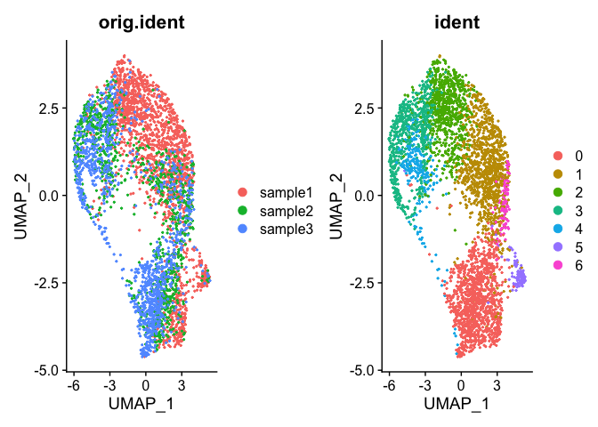
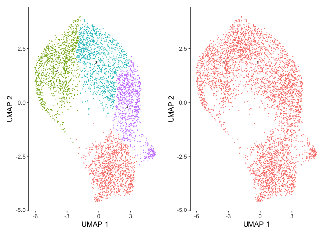
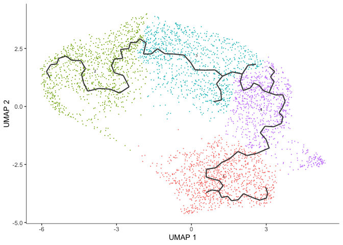
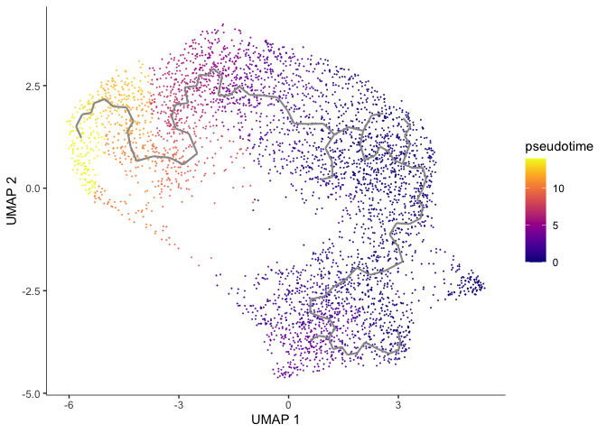
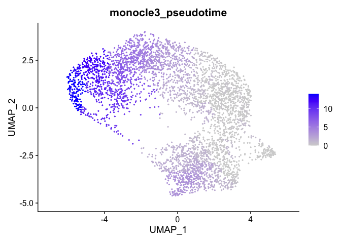
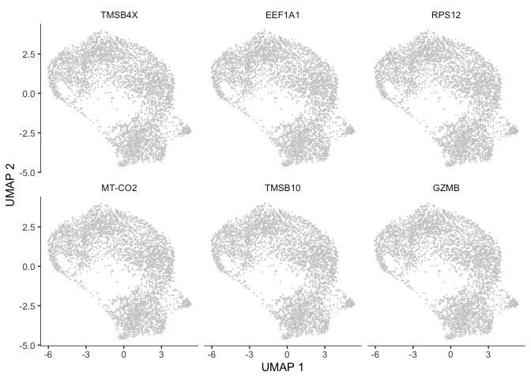
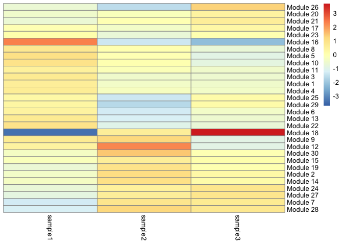
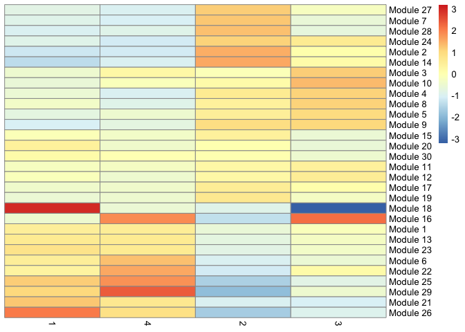
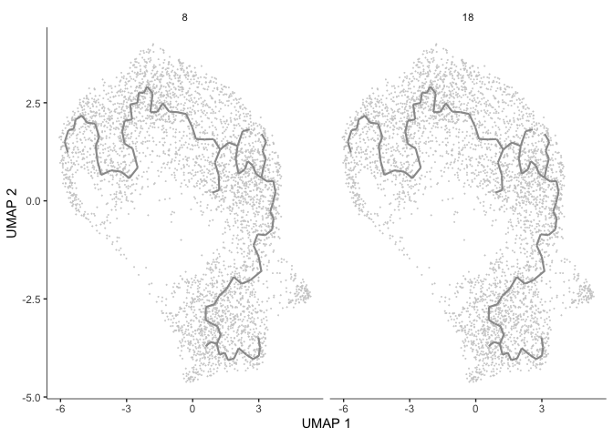

# Trajectory Analysis with Monocle 3

[Monocle](http://cole-trapnell-lab.github.io/monocle-release/), from the Trapnell Lab, is a piece of the TopHat suite (for RNAseq) that performs among other things differential expression, trajectory, and pseudotime analyses on single cell RNA-Seq data. A very comprehensive [tutorial](http://cole-trapnell-lab.github.io/monocle-release/docs/#recommended-analysis-protocol) can be found on the Trapnell lab website. We will be using Monocle3, which is still in the "beta" phase of its development and hasn't been updated in a few years. The development branch however has some activity in the last year in preparation for Monocle3.1.


```r
library(monocle3)
library(Seurat)
library(SeuratWrappers)
library(patchwork)
#library(dplyr)

set.seed(1234)
```

I prefer to use a few custom colorblind-friendly palettes, so we will set those up now. The palettes used in this exercise were developed by Paul Tol. You can learn more about them on [Tol's webpage](https://personal.sron.nl/~pault/#sec:qualitative).


```r
tol_high_contrast_palette <- c("#DDAA33", "#BB5566", "#004488")
tol_vibrant_palette <- c("#0077BB", "#33BBEE", "#009988",
                         "#EE7733", "#CC3311", "#EE3377",
                         "#BBBBBB")
tol_muted_palette <- c("#332288", "#88CCEE", "#44AA99",
                       "#117733", "#999933", "#DDCC77",
                       "#CC6677", "#882255", "#AA4499")
```


### Project set-up

Because Seurat is now the most widely used package for single cell data analysis we will want to use Monocle with Seurat. For greater detail on single cell RNA-Seq analysis, see the Introductory course materials [here](https://ucdavis-bioinformatics-training.github.io/2021-August-Single-Cell-RNA-Seq-Analysis/).

## Loading data into Seurat


```r
data_location <- "data_download/"
samples <- c("sample1", "sample2", "sample3")

raw10x <- lapply(samples, function(i){
  d10x <- Read10X_h5(file.path(data_location, paste0(i, "_raw_feature_bc_matrix.h5")))
  colnames(d10x$`Gene Expression`) <- paste(sapply(strsplit(colnames(d10x$`Gene Expression`),split="-"),'[[',1L),i,sep="-")
  colnames(d10x$`Antibody Capture`) <- paste(sapply(strsplit(colnames(d10x$`Antibody Capture`),split="-"),'[[',1L),i,sep="-")
  d10x
})
```

```
## Genome matrix has multiple modalities, returning a list of matrices for this genome
## Genome matrix has multiple modalities, returning a list of matrices for this genome
## Genome matrix has multiple modalities, returning a list of matrices for this genome
```

```r
names(raw10x) <- samples
trA <- CreateSeuratObject(do.call("cbind", lapply(raw10x,"[[", "Gene Expression")),
                          project = "cellranger multi",
                          min.cells = 0,
                          min.features = 300,
                          names.field = 2,
                          names.delim = "\\-")
trA$percent_mito <- PercentageFeatureSet(trA, pattern = "^MT-")

trA <- subset(trA, percent_mito <= 10)
trA <- subset(trA, nCount_RNA <= 10000)
trA <- subset(trA, nFeature_RNA >= 500)
table(trA$orig.ident)
```

```
## 
## sample1 sample2 sample3 
##    1855     999    1200
```


## Seurat processing of data

Because we don't want to do the exact same thing as we did in the Velocity analysis, lets instead use the Integration technique.


```r
# First split the sample by original identity
trA.list <- SplitObject(trA, split.by = "orig.ident")

# perform standard preprocessing on each object
for (i in 1:length(trA.list)) {
  trA.list[[i]] <- NormalizeData(trA.list[[i]], verbose = FALSE)
  trA.list[[i]] <- FindVariableFeatures(
    trA.list[[i]], selection.method = "vst",
    nfeatures = 2000, verbose = FALSE
  )
}

features <- SelectIntegrationFeatures(trA.list)
for (i in seq_along(along.with = trA.list)) {
    trA.list[[i]] <- ScaleData(trA.list[[i]], features = features)
    trA.list[[i]] <- RunPCA(trA.list[[i]], features = features)
}
```

```
## Centering and scaling data matrix
```

```
## PC_ 1 
## Positive:  PCLAF, CST7, NKG7, RRM2, CCL5, GZMA, GZMH, PTTG1, ACTB, GZMB 
## 	   S100A4, LGALS1, MKI67, ANXA2, BIRC5, IL32, TK1, CENPM, GZMK, CCNA2 
## 	   CLSPN, CDC20, GNLY, PLEK, CLIC1, CYTOR, GINS2, TPX2, TMSB4X, CD99 
## Negative:  EEF1A1, RPL13, RPL18A, RPS8, RPS3A, RPS18, TPT1, RPS12, RPS23, RPS5 
## 	   RPS6, EEF1B2, RPL7A, RPL8, RPS16, RPLP2, RPL17, LTB, LINC02446, RPLP0 
## 	   TCF7, IL7R, SNHG29, FOS, NELL2, RPL37A, RPL4, CCR7, RPL7, RPSA 
## PC_ 2 
## Positive:  RPLP0, RPS8, LDHB, RPS5, SNHG29, RPS6, RPL4, RRM2, RPS3A, NPM1 
## 	   RPS18, PCLAF, RPS16, TMSB10, SLC25A5, STMN1, RPL7, EEF1B2, AIF1, RPS23 
## 	   RPL18A, VIM, CCR7, RPL37A, RPSA, TUBB, CCNA2, EEF1A1, GINS2, TKT 
## Negative:  CST7, NKG7, GNLY, CCL5, GZMK, GZMA, CTSW, IL32, HOPX, TRDV2 
## 	   KLRD1, TRGV9, FGR, KLRG1, NCR3, S100A4, TYROBP, LYAR, XCL2, PLEK 
## 	   MT-CYB, CD74, DUSP2, MYO1F, XCL1, MAP3K8, BHLHE40, FCRL3, KLRC2, GZMH 
## PC_ 3 
## Positive:  KLRB1, GZMA, RPL13, KLRG1, PLEK, RPS12, ZBTB16, CXCR6, TRDV2, TRAV1-2 
## 	   SLC4A10, EEF1A1, RPLP0, RPL17, GZMH, TGFBR3, RPS8, KLRC1, BHLHE40, RPS18 
## 	   TRBV6-4, PRF1, TRGV9, GZMB, RPL18A, ALOX5AP, MYC, AC245014.3, IL18RAP, CD160 
## Negative:  IFITM1, TMSB10, ZNF683, TMSB4X, MT-CO2, MT-CYB, KLRC2, XCL1, MT-CO1, CXCR3 
## 	   IFITM2, CD52, CTSW, XCL2, MT-CO3, ACTB, FUT7, MT-ND4, IFITM3, LINC02446 
## 	   TCF7, KLRC3, LGALS1, FCRL3, KLRC4, FCER1G, ITM2C, SLFN5, PLAC8, MT-ATP6 
## PC_ 4 
## Positive:  RRM2, CCNA2, ASPM, DHFR, ASF1B, KLRC2, MT-ND4L, PKMYT1, RAD51, ZWINT 
## 	   XCL1, CDCA8, CENPM, MT-CYB, KIF2C, AURKB, KNL1, NDC80, UBE2C, XCL2 
## 	   NUSAP1, KIF14, CTSW, KIFC1, DIAPH3, HMMR, MT-CO2, CDK1, MKI67, TK1 
## Negative:  ACTG1, ACTB, KLRB1, EIF4A1, MYH9, PSMB10, GZMA, CORO1A, ATP5F1B, PSME2 
## 	   HSP90AB1, S100A6, CD28, GAPDH, EWSR1, LCP1, SH3BGRL3, GZMH, FLNA, ENO1 
## 	   ACTR3, AQP3, NPM1, DENND2D, CNN2, LDHB, PSMB8, DYNLL1, SAT1, NDUFB3 
## PC_ 5 
## Positive:  PTTG1, CDC20, BIRC5, HLA-DRA, CDKN3, LGALS1, FGFBP2, CENPF, CCNB1, CYTOR 
## 	   HLA-DRB1, GZMH, TROAP, TPX2, CD38, CENPE, PLK1, GZMA, LAG3, CX3CR1 
## 	   MND1, MKI67, HLA-DPB1, ANXA2, CD8B, HIST1H2BH, HLA-DRB5, HMMR, ZEB2, CCL4 
## Negative:  IFITM2, CTSW, FOS, LTB, IFITM1, NCR3, XCL1, LST1, GINS2, CRIP1 
## 	   MCM2, ATAD5, DTL, HSP90AB1, DDIT4, TRBV20-1, HELLS, MIF, IL32, FAM111B 
## 	   JUNB, MT-ND5, MAP3K1, S100A4, FCER1G, IFITM3, MT-ND1, HSP90AA1, TIMP1, TCF19
```

```
## Centering and scaling data matrix
```

```
## PC_ 1 
## Positive:  CCL5, RPL13, TPT1, RPS12, RPL18A, EEF1A1, IFITM1, GZMK, LTB, ZFP36 
## 	   RPS23, FOS, KLRB1, CD74, RPL7A, ZNF331, SLC2A3, KLF6, CD27, MT-CO1 
## 	   NR4A2, IL7R, SLFN5, JUN, RPS18, CST7, KLRG1, TNFAIP3, TENT5C, PDCD4 
## Negative:  TUBA1B, RRM2, STMN1, H2AFZ, TUBB, PCNA, PCLAF, MCM7, HMGB2, CENPM 
## 	   RAN, DUT, HIST1H4C, GINS2, DNAJC9, PTMA, HMGN2, TPI1, TK1, FABP5 
## 	   FEN1, DHFR, MCM5, CENPW, GAPDH, ZWINT, CLSPN, ASF1B, MCM3, NASP 
## PC_ 2 
## Positive:  TMSB4X, ACTG1, ACTB, CAPG, PLAC8, CNN2, RPLP0, VIM, HSP90AB1, PRDX1 
## 	   PPIA, S100A6, PSMA5, NME2, GAPDH, HNRNPA1, SELL, ANXA2, PPIB, CFL1 
## 	   TMSB10, HMGN2, MYL6, MRPL51, ATP5MC3, DANCR, SLC25A5, PSME2, EIF4A1, CCT5 
## Negative:  NUSAP1, SPC25, CDK1, HIST1H1B, HIST1H2AJ, UBE2C, CDCA8, KIFC1, HIST1H2AI, NKG7 
## 	   HIST1H4C, KIF23, RRM2, CDCA5, ASPM, CKS2, NDC80, TOP2A, ARHGAP11A, CCNA2 
## 	   CCL5, CKAP2L, GZMA, GZMH, NCAPG, PKMYT1, TPX2, CKS1B, TTK, HJURP 
## PC_ 3 
## Positive:  GZMH, NKG7, GZMA, GZMB, GNLY, SH3BGRL3, CCL5, S100A4, FGFBP2, IL32 
## 	   CST7, HOPX, KLRD1, ANXA1, CRIP1, LGALS1, PRF1, CLIC3, CFL1, SPON2 
## 	   APOBEC3G, LY6E, CTSW, BHLHE40, CD99, CD52, PPIB, CCL4, ACTB, CD63 
## Negative:  RPS12, EEF1A1, TCF7, RPL13, LTB, RPS18, CCR7, RPL18A, PLAC8, RPS8 
## 	   SELL, LEF1, RPS5, RPS23, RPS3A, CAPG, RPLP2, RPL7A, NOSIP, EEF1B2 
## 	   AC004585.1, NELL2, RPLP0, RPL4, RPL8, RPL17, TPT1, AQP3, IL7R, ARMH1 
## PC_ 4 
## Positive:  PLK1, CCNB1, CDC20, DLGAP5, CDCA8, TMSB4X, CCNB2, CENPF, CDCA3, NEK2 
## 	   TPX2, UBE2C, KIF14, ASPM, BIRC5, PTTG1, HMMR, AURKB, CDKN3, ACTG1 
## 	   ACTB, KIF20A, TMSB10, TOP2A, ARL6IP1, CENPE, RACGAP1, DEPDC1B, DIAPH3, KIF23 
## Negative:  GINS2, RPL18A, RPS12, RPL13, EEF1A1, RPS8, RPS23, MCM10, RPL8, UNG 
## 	   CDC45, MSH6, RPS6, RPS18, MCM3, MCM7, PCNA, C19orf48, DTL, MCM4 
## 	   FEN1, MCM6, GNLY, CDCA7, FTL, FAM111B, MCM2, RPL17, RPLP0, RPL7A 
## PC_ 5 
## Positive:  MT-CO1, MT-CO2, MT-CO3, MT-CYB, FLNA, MT-ATP6, HIST1H1E, COTL1, MT-ATP8, MT-ND5 
## 	   MT-ND4L, MYH9, MT-ND6, RPS2, MT-ND4, HNRNPU, LGALS1, MT-ND1, HMGA1, MSN 
## 	   MTA2, AC011446.2, CD81, ACTN4, AC005944.1, MYO1G, CDT1, AL133415.1, PLEC, RASSF2 
## Negative:  CDC20, PLK1, CCNB1, CDKN3, RPL18A, IFITM1, KIF20A, KIF14, KPNA2, RPS3A 
## 	   CCNB2, EEF1A1, LDHA, RPS23, FTL, RPL7A, PTMA, NEK2, RPL8, KLRB1 
## 	   TUBB4B, NKG7, RPL17, CKS1B, CTSW, HSP90B1, RPS8, KLRD1, CDCA3, PTTG1
```

```
## Centering and scaling data matrix
```

```
## PC_ 1 
## Positive:  CCL5, NKG7, IFITM1, CST7, CD52, ZFP36, SH3BGRL3, ZNF683, IL7R, LTB 
## 	   FGFBP2, KLRB1, FOS, TPT1, KLRG1, TNFAIP3, SLFN5, SLC2A3, JUN, TMSB4X 
## 	   TRBV28, ZNF331, S100B, ALOX5AP, CCL4, TCF7, TRAV17, DDIT4, GZMH, PATL2 
## Negative:  TUBA1B, RRM2, STMN1, H2AFZ, TUBB, HMGB2, PCLAF, FABP5, MCM7, FEN1 
## 	   RAN, HIST1H4C, GAPDH, PCNA, HMGN2, PTMA, CLSPN, CENPM, CENPW, DHFR 
## 	   TXN, PTTG1, RPA3, SMC2, HMGB1, HSPD1, TPI1, TUBB4B, GMNN, GINS2 
## PC_ 2 
## Positive:  GZMK, RPS12, RPS18, EEF1A1, RPS8, RPL18A, RPS23, RPL7A, LEF1, RPL8 
## 	   RPS3A, RPS5, RPS6, CD28, CPNE2, CD27, RPLP0, LTB, RPLP2, PLAC8 
## 	   SNHG29, TCF7, CNN2, AIF1, DANCR, LIMS1, CCR7, NME2, RPL17, SELL 
## Negative:  GZMB, NKG7, FGFBP2, GZMH, GNLY, GZMA, PRF1, S100A4, CCL4, UBE2C 
## 	   SH3BGRL3, SPON2, CX3CR1, NUSAP1, KIFC1, CRIP1, CDK1, TPX2, HIST1H4C, CCL5 
## 	   CST7, RACGAP1, TOP2A, RRM2, CENPE, CKS1B, CKAP2L, CENPF, PLEK, TUBB4B 
## PC_ 3 
## Positive:  GZMB, GZMH, S100A4, PRF1, LGALS1, GNLY, GZMA, S100A11, SH3BGRL3, NKG7 
## 	   S100A6, ANXA2, FGFBP2, CX3CR1, PLEK, PPIB, HOPX, ANXA1, SPON2, PSME2 
## 	   APOBEC3G, HSP90AB1, LY6E, IL32, HSPA5, IFITM2, DCTPP1, HSP90B1, LGALS3, GAPDH 
## Negative:  UBE2C, TOP2A, CDK1, NUSAP1, GZMK, TPX2, HIST1H2AI, JUN, KIFC1, KIF23 
## 	   PLK1, HIST1H3D, HIST1H2AJ, CDCA2, ANLN, TCF7, RACGAP1, CDCA3, HIST1H4C, CDCA8 
## 	   SPC25, HIST1H3C, HIST1H3B, HIST2H2AB, KIF22, ASPM, AURKB, GTSE1, CENPF, CENPE 
## PC_ 4 
## Positive:  CCNB1, CDC20, PTTG1, ACTG1, CCNB2, TMSB4X, CENPF, PLK1, IFITM1, HMGB3 
## 	   CDKN3, DLGAP5, TPX2, TROAP, ARL6IP1, HMMR, CLIC1, LGALS1, ANP32E, ANXA2 
## 	   BIRC5, PIMREG, JPT1, ASPM, AURKB, IFIT3, KNSTRN, HSPA5, CENPE, DYNLL1 
## Negative:  MCM7, GINS2, PCNA, MCM5, ATAD2, MCM3, MCM4, FEN1, CDC45, CLSPN 
## 	   PCLAF, DHFR, FAM111B, MCM2, LIG1, TCF19, RAD51, DTL, TMEM106C, MCM6 
## 	   C19orf48, SIVA1, POLA2, RNASEH2A, CENPM, UHRF1, CENPX, DUT, RRM2, DNAJC9 
## PC_ 5 
## Positive:  FOS, IL32, HLA-DRB5, CD74, IFITM1, TMSB4X, EEF1A1, ITM2A, LTB, PPIA 
## 	   JUN, ALOX5AP, CD160, PSME2, HLA-DPA1, HLA-DPB1, LDHB, PGK1, ZWINT, HLA-DRA 
## 	   SLC25A5, ACTG1, CD99, XCL2, CFL1, PPP1CA, CTSW, XCL1, HSPB11, TALDO1 
## Negative:  MT-CO1, RPS2, MT-CO2, FLNA, MT-ND5, MT-ND6, MT-ATP6, ABHD17A, LGALS3, MT-CO3 
## 	   FKBP4, AHNAK, MT-CYB, GZMB, VIM, AL138963.4, GNLY, MT-ND4L, MT-ND4, VPS4A 
## 	   ESYT2, AC004687.1, IDH2, SF3B3, NSD2, HNRNPU, MT-ND1, GPR180, VCL, TPM4
```

```r
# find anchors
anchors <- FindIntegrationAnchors(object.list = trA.list)
```

```
## Computing 2000 integration features
```

```
## Scaling features for provided objects
```

```
## Finding all pairwise anchors
```

```
## Running CCA
```

```
## Merging objects
```

```
## Finding neighborhoods
```

```
## Finding anchors
```

```
## 	Found 4259 anchors
```

```
## Filtering anchors
```

```
## 	Retained 1620 anchors
```

```
## Running CCA
```

```
## Merging objects
```

```
## Finding neighborhoods
```

```
## Finding anchors
```

```
## 	Found 5045 anchors
```

```
## Filtering anchors
```

```
## 	Retained 1395 anchors
```

```
## Running CCA
```

```
## Merging objects
```

```
## Finding neighborhoods
```

```
## Finding anchors
```

```
## 	Found 3975 anchors
```

```
## Filtering anchors
```

```
## 	Retained 1807 anchors
```

```r
# integrate data
trA.integrated <- IntegrateData(anchorset = anchors)
```

```
## Merging dataset 2 into 3
```

```
## Extracting anchors for merged samples
```

```
## Finding integration vectors
```

```
## Finding integration vector weights
```

```
## Integrating data
```

```
## Merging dataset 1 into 3 2
```

```
## Extracting anchors for merged samples
```

```
## Finding integration vectors
```

```
## Finding integration vector weights
```

```
## Integrating data
```

```r
trA.integrated <- ScaleData(trA.integrated)
```

```
## Centering and scaling data matrix
```

```r
trA.integrated <- RunPCA(trA.integrated)
```

```
## PC_ 1 
## Positive:  RRM2, TUBA1B, STMN1, PCLAF, H2AFZ, HMGB2, TUBB, FABP5, MCM7, FEN1 
## 	   CLSPN, CENPW, DHFR, CENPM, PCNA, UBE2T, PTTG1, GMNN, HIST1H4C, GINS2 
## 	   SMC2, PTMA, ZWINT, TUBB4B, HMGN2, RPA3, LMNB1, TXN, CKS1B, RAN 
## Negative:  CCL5, CST7, NKG7, IFITM1, CD160, ZNF683, LTB, TPT1, SLFN5, TRBV28 
## 	   ZFP36, CD52, FOS, SLC2A3, PATL2, IL7R, FCRL3, EEF1A1, TMSB4X, JUN 
## 	   ZEB2, TRAV17, MAF, TNFAIP3, SH3BGRL3, ALOX5AP, KLRG1, RPL18A, IL10RA, TRBV5-6 
## PC_ 2 
## Positive:  GZMK, RPS12, EEF1A1, RPS18, RPL18A, RPS8, RPS23, RPL8, RPS3A, RPS6 
## 	   RPL7A, RPLP2, RPL13, RPS5, RPLP0, EEF1B2, CNN2, RPL17, PLAC8, LIMS1 
## 	   CD27, CD28, LTB, LEF1, NOSIP, NME2, SELL, SNHG29, MT-CO3, DANCR 
## Negative:  GZMB, FGFBP2, GZMH, GNLY, CCL4, GZMA, PRF1, NKG7, CX3CR1, SPON2 
## 	   S100A4, CST7, UBE2C, PLEK, NUSAP1, SH3BGRL3, KIFC1, CDK1, ASPM, CLIC3 
## 	   HOPX, CCL5, LGALS1, KLRD1, TPX2, CRIP1, S100A11, HIST1H4C, CKAP2L, CENPE 
## PC_ 3 
## Positive:  GZMB, LGALS1, GZMH, PRF1, GNLY, GZMA, S100A11, S100A4, ANXA2, PLEK 
## 	   FGFBP2, PPIB, NKG7, S100A6, APOBEC3G, CX3CR1, ACTB, HOPX, SPON2, IL32 
## 	   HSPA5, ANXA1, HSP90AB1, SH3BGRL3, DCTPP1, S100A10, CCT5, PSME2, IFI30, LGALS3 
## Negative:  UBE2C, TOP2A, CDK1, NUSAP1, CDCA8, KIFC1, HIST1H2AI, HIST1H2AJ, TPX2, SPC25 
## 	   CDCA3, KIF23, ASPM, CDCA2, HIST1H3C, PLK1, DIAPH3, RACGAP1, HIST1H1B, HIST1H4C 
## 	   HJURP, CDCA5, HIST1H3D, GTSE1, JUN, HIST1H3B, HIST2H2AB, CKAP2L, KIF15, ANLN 
## PC_ 4 
## Positive:  CDC20, CCNB1, PLK1, CCNB2, PTTG1, CENPF, DLGAP5, ACTG1, CDKN3, TMSB4X 
## 	   TPX2, HMMR, AURKB, BIRC5, TROAP, ASPM, CENPE, KNSTRN, PIMREG, ARL6IP1 
## 	   HMGB3, JPT1, KIF14, NEK2, NUF2, KIF20A, DEPDC1B, TUBA1C, ANP32E, DYNLL1 
## Negative:  GINS2, MCM7, PCNA, CDC45, MCM4, MCM5, ATAD2, FAM111B, CLSPN, MCM2 
## 	   MCM3, TCF19, FEN1, DTL, MCM10, MCM6, RAD51, UHRF1, DHFR, LIG1 
## 	   HELLS, TMEM106C, POLA2, CHEK1, RBBP8, CDC6, CCNE2, BRCA2, PCLAF, RFC2 
## PC_ 5 
## Positive:  CCNB1, CDC20, CDKN3, RPS12, CCNB2, PLK1, NOP16, RPS8, BIRC5, RPS3A 
## 	   DLGAP5, KNSTRN, HPDL, GNLY, RPS23, NUF2, GZMB, RPL8, SPON2, DEPDC1B 
## 	   HMMR, DCTPP1, KIF14, ALYREF, RPL18A, NPM3, TROAP, MRPL18, HMGB3, CEP57L1 
## Negative:  IL32, TMSB4X, HIST1H1D, ACTG1, UCP2, HIST1H2AL, CD74, DENND2D, PPP1CA, HIST1H3B 
## 	   CORO1A, HLA-DRA, APOBEC3G, CFL1, CHI3L2, FOS, HIST1H2AJ, HIST1H1C, LIMS1, XCL2 
## 	   CD52, ATP5F1B, HIST1H1E, ACTB, CXCR3, CCL5, LDHB, HIST1H1B, HLA-DRB5, GZMK
```

```r
trA.integrated <- RunUMAP(trA.integrated, dims = 1:50, reduction.name = "UMAP")
```

```
## 12:28:33 UMAP embedding parameters a = 0.9922 b = 1.112
```

```
## 12:28:33 Read 4054 rows and found 50 numeric columns
```

```
## 12:28:33 Using Annoy for neighbor search, n_neighbors = 30
```

```
## 12:28:33 Building Annoy index with metric = cosine, n_trees = 50
```

```
## 0%   10   20   30   40   50   60   70   80   90   100%
```

```
## [----|----|----|----|----|----|----|----|----|----|
```

```
## **************************************************|
## 12:28:33 Writing NN index file to temp file /var/folders/c6/zbknwx5d7wlfqhgpy83jlg1h0000gp/T//Rtmp7T0tKt/file8dd41f34a188
## 12:28:33 Searching Annoy index using 1 thread, search_k = 3000
## 12:28:35 Annoy recall = 100%
## 12:28:35 Commencing smooth kNN distance calibration using 1 thread
## 12:28:37 Initializing from normalized Laplacian + noise
## 12:28:37 Commencing optimization for 500 epochs, with 189498 positive edges
## 12:28:43 Optimization finished
```

```r
trA.integrated <- FindNeighbors(trA.integrated, dims = 1:50)
```

```
## Computing nearest neighbor graph
## Computing SNN
```

```r
trA.integrated <- FindClusters(trA.integrated)
```

```
## Modularity Optimizer version 1.3.0 by Ludo Waltman and Nees Jan van Eck
## 
## Number of nodes: 4054
## Number of edges: 297149
## 
## Running Louvain algorithm...
## Maximum modularity in 10 random starts: 0.7424
## Number of communities: 7
## Elapsed time: 0 seconds
```

```r
DimPlot(trA.integrated, group.by = c("orig.ident", "ident"))
```

<!-- -->
**QUESTION**

How does this result look different from the result produced in the velocity section?

## Setting up monocle3 cell_data_set object using the SueratWrappers

monocle3 uses a `cell_data_set` object, the `as.cell_data_set` function from SeuratWrappers can be used to "convert" a Seurat object to Monocle object. Moving the data calculated in Seurat to the appropriate slots in the Monocle object. 


For trajectory analysis, 'partitions' as well as 'clusters' are needed and so the Monocle cluster_cells function must also be performed. Monocle's clustering technique is more of a community based algorithm and actually uses the uMap plot (sort of) in its routine and partitions are more well separated groups using a statistical test from [Alex Wolf et al](https://genomebiology.biomedcentral.com/articles/10.1186/s13059-019-1663-x), 


```r
cds <- as.cell_data_set(trA.integrated)
cds <- cluster_cells(cds, resolution=1e-3)

p1 <- plot_cells(cds, color_cells_by = "cluster", show_trajectory_graph = FALSE)
p2 <- plot_cells(cds, color_cells_by = "partition", show_trajectory_graph = FALSE)
wrap_plots(p1, p2)
```

<!-- -->

Spend a moment looking at the cell_data_set object and its slots (using `slotNames`) as well as `cluster_cells`. Try updating the resolution parameter to generate more clusters (try 1e-5, 1e-3, 1e-1, and 0).

How many clusters are generated at each level?

### Subsetting partitions

Because partitions are high level separations of the data (yes we have only 1 here). It may make sense to then perform trajectory analysis on each partition separately. To do this we sould go back to Seurat, subset by partition, then back to a CDS


```r
integrated.sub <- subset(as.Seurat(cds, assay = NULL), monocle3_partitions == 1)
cds <- as.cell_data_set(integrated.sub)
```

```
## Using existing Monocle 3 cluster membership and partitions
```


# Trajectory analysis

In a data set like this one, cells were not harvested in a time series, but may not have all been at the same developmental stage. Monocle offers trajectory analysis to model the relationships between groups of cells as a trajectory of gene expression changes. The first step in trajectory analysis is the `learn_graph()` function. This may be time consuming.


```r
cds <- learn_graph(cds, use_partition = TRUE, verbose = FALSE)
```

After learning the graph, monocle can plot add the trajectory graph to the cell plot.


```r
plot_cells(cds,
           color_cells_by = "cluster",
           label_groups_by_cluster=FALSE,
           label_leaves=FALSE,
           label_branch_points=FALSE)
```

<!-- -->

Not all of our trajectories are connected. In fact, only clusters that belong to the same partition are connected by a trajectory.

# Color cells by pseudotime

We can set the root to any one of our clusters by selecting the cells in that cluster to use as the root in the function `order_cells`. All cells that cannot be reached from a trajectory with our selected root will be gray, which represents "infinite" pseudotime.


```r
cds <- order_cells(cds, root_cells = colnames(cds[,clusters(cds) == 4]))
plot_cells(cds,
           color_cells_by = "pseudotime",
           group_cells_by = "cluster",
           label_cell_groups = FALSE,
           label_groups_by_cluster=FALSE,
           label_leaves=FALSE,
           label_branch_points=FALSE,
           label_roots = FALSE,
           trajectory_graph_color = "grey60")
```

<!-- -->

Here the pseudotime trajectory is rooted in cluster 5. This choice was arbitrary. In reality, you would make the decision about where to root your trajectory based upon what you know about your experiment. If, for example, the markers identified with cluster 1 suggest to you that cluster 1 represents the earliest developmental time point, you would likely root your pseudotime trajectory there. Explore what the pseudotime analysis looks like with the root in different clusters. Because we have not set a seed for the random process of clustering, cluster numbers will differ between R sessions.


We can export this data to the Seurat object and visualize

```r
integrated.sub <- as.Seurat(cds, assay = NULL)
FeaturePlot(integrated.sub, "monocle3_pseudotime")
```

<!-- -->


# Identify genes that change as a function of pseudotime

Monocle's `graph_test()` function detects genes that vary over a trajectory. This may run very slowly. Adjust the number of cores as needed.


```r
cds_graph_test_results <- graph_test(cds,
                                     neighbor_graph = "principal_graph",
                                     cores = 8)
```

 * You may have an issue with this function in newer version of R an rBind Error.
 * Can fix this by:
    * trace('calculateLW', edit = T, where = asNamespace("monocle3"))
    * find Matrix::rBind and replace with rbind then save.
  
The output of this function is a table. We can look at the expression of some of these genes overlaid on the trajectory plot.


```r
rowData(cds)$gene_short_name <- row.names(rowData(cds))

head(cds_graph_test_results, error=FALSE, message=FALSE, warning=FALSE)

deg_ids <- rownames(subset(cds_graph_test_results[order(cds_graph_test_results$morans_I, decreasing = TRUE),], q_value < 0.05))

plot_cells(cds,
           genes=head(deg_ids),
           show_trajectory_graph = FALSE,
           label_cell_groups = FALSE,
           label_leaves = FALSE)
```

<!-- -->

We can also calculate modules of co-expressed genes. By providing the module-finding function with a list of possible resolutions, we are telling Louvain to perform the clustering at each resolution and select the result with the greatest modularity. Modules will only be calculated for genes that vary as a function of pseudotime.

This heatmap displays the association of each gene module with each cell type.


```r
gene_modules <- find_gene_modules(cds[deg_ids,],
                                  resolution=c(10^seq(-6,-1)))
table(gene_modules$module)
```

```
## 
##  1  2  3  4  5  6  7  8  9 10 11 12 13 14 15 16 17 18 19 20 21 22 23 24 25 26 
## 70 70 69 64 60 56 55 54 54 50 49 48 47 45 44 43 40 40 39 39 39 35 32 32 29 29 
## 27 28 29 30 
## 28 27 27 17
```

```r
cell_groups <- data.frame(cell = row.names(colData(cds)),
                             cell_group = colData(cds)$orig.ident)
agg_mat <- aggregate_gene_expression(cds,
                                     gene_group_df = gene_modules,
                                     cell_group_df = cell_groups)
dim(agg_mat)
```

```
## [1] 30  3
```

```r
row.names(agg_mat) <- paste0("Module ", row.names(agg_mat))
pheatmap::pheatmap(agg_mat,
                   scale="column",
                   treeheight_row = 0,
                   treeheight_col = 0,
                   clustering_method="ward.D2")
```

<!-- -->
We can also display the relationship between gene modules and monocle clusters as a heatmap.


```r
cluster_groups <- data.frame(cell = row.names(colData(cds)),
                             cluster_group = cds@clusters$UMAP[[2]])
agg_mat2 <- aggregate_gene_expression(cds, gene_modules, cluster_groups)
dim(agg_mat2)
```

```
## [1] 30  4
```

```r
row.names(agg_mat2) <- paste0("Module ", row.names(agg_mat2))
pheatmap::pheatmap(agg_mat2,
                   scale="column",
                   treeheight_row = 0,
                   treeheight_col = 0,
                   clustering_method="ward.D2")
```

<!-- -->


```r
gm <- gene_modules[which(gene_modules$module %in% c(8, 18)),]
plot_cells(cds,
           genes=gm,
           label_cell_groups=FALSE,
           show_trajectory_graph=TRUE,
           label_branch_points = FALSE,
           label_roots = FALSE,
           label_leaves = FALSE,
           trajectory_graph_color = "grey60")
```

```
## Warning: `guides(<scale> = FALSE)` is deprecated. Please use `guides(<scale> =
## "none")` instead.
```

<!-- -->


# R session information

```r
sessionInfo()
```

```
## R version 4.1.0 (2021-05-18)
## Platform: x86_64-apple-darwin17.0 (64-bit)
## Running under: macOS Big Sur 10.16
## 
## Matrix products: default
## BLAS:   /Library/Frameworks/R.framework/Versions/4.1/Resources/lib/libRblas.dylib
## LAPACK: /Library/Frameworks/R.framework/Versions/4.1/Resources/lib/libRlapack.dylib
## 
## locale:
## [1] en_US.UTF-8/en_US.UTF-8/en_US.UTF-8/C/en_US.UTF-8/en_US.UTF-8
## 
## attached base packages:
## [1] stats4    parallel  stats     graphics  grDevices utils     datasets 
## [8] methods   base     
## 
## other attached packages:
##  [1] patchwork_1.1.1             SeuratWrappers_0.3.0       
##  [3] SeuratObject_4.0.2          Seurat_4.0.3               
##  [5] monocle3_1.0.0              SingleCellExperiment_1.14.1
##  [7] SummarizedExperiment_1.22.0 GenomicRanges_1.44.0       
##  [9] GenomeInfoDb_1.28.1         IRanges_2.26.0             
## [11] S4Vectors_0.30.0            MatrixGenerics_1.4.2       
## [13] matrixStats_0.60.0          Biobase_2.52.0             
## [15] BiocGenerics_0.38.0        
## 
## loaded via a namespace (and not attached):
##   [1] plyr_1.8.6             igraph_1.2.6           lazyeval_0.2.2        
##   [4] sp_1.4-5               splines_4.1.0          listenv_0.8.0         
##   [7] scattermore_0.7        ggplot2_3.3.5          digest_0.6.27         
##  [10] htmltools_0.5.1.1      viridis_0.6.1          gdata_2.18.0          
##  [13] fansi_0.5.0            magrittr_2.0.1         tensor_1.5            
##  [16] cluster_2.1.2          ROCR_1.0-11            remotes_2.4.0         
##  [19] globals_0.14.0         gmodels_2.18.1         R.utils_2.10.1        
##  [22] spatstat.sparse_2.0-0  colorspace_2.0-2       ggrepel_0.9.1         
##  [25] xfun_0.25              dplyr_1.0.7            crayon_1.4.1          
##  [28] RCurl_1.98-1.4         jsonlite_1.7.2         spatstat.data_2.1-0   
##  [31] survival_3.2-12        zoo_1.8-9              glue_1.4.2            
##  [34] polyclip_1.10-0        gtable_0.3.0           zlibbioc_1.38.0       
##  [37] XVector_0.32.0         leiden_0.3.9           DelayedArray_0.18.0   
##  [40] future.apply_1.8.1     abind_1.4-5            scales_1.1.1          
##  [43] pheatmap_1.0.12        DBI_1.1.1              miniUI_0.1.1.1        
##  [46] Rcpp_1.0.7             spData_0.3.10          viridisLite_0.4.0     
##  [49] xtable_1.8-4           units_0.7-2            reticulate_1.20       
##  [52] spatstat.core_2.3-0    spdep_1.1-8            proxy_0.4-26          
##  [55] bit_4.0.4              rsvd_1.0.5             htmlwidgets_1.5.3     
##  [58] httr_1.4.2             RColorBrewer_1.1-2     ellipsis_0.3.2        
##  [61] ica_1.0-2              farver_2.1.0           pkgconfig_2.0.3       
##  [64] R.methodsS3_1.8.1      sass_0.4.0             uwot_0.1.10           
##  [67] deldir_0.2-10          utf8_1.2.2             tidyselect_1.1.1      
##  [70] labeling_0.4.2         rlang_0.4.11           reshape2_1.4.4        
##  [73] later_1.3.0            pbmcapply_1.5.0        munsell_0.5.0         
##  [76] tools_4.1.0            generics_0.1.0         ggridges_0.5.3        
##  [79] evaluate_0.14          stringr_1.4.0          fastmap_1.1.0         
##  [82] yaml_2.2.1             goftest_1.2-2          knitr_1.33            
##  [85] bit64_4.0.5            fitdistrplus_1.1-5     purrr_0.3.4           
##  [88] RANN_2.6.1             pbapply_1.4-3          future_1.21.0         
##  [91] nlme_3.1-152           mime_0.11              slam_0.1-48           
##  [94] grr_0.9.5              R.oo_1.24.0            hdf5r_1.3.3           
##  [97] compiler_4.1.0         plotly_4.9.4.1         png_0.1-7             
## [100] e1071_1.7-8            spatstat.utils_2.2-0   tibble_3.1.3          
## [103] bslib_0.2.5.1          stringi_1.7.3          highr_0.9             
## [106] RSpectra_0.16-0        lattice_0.20-44        Matrix_1.3-4          
## [109] classInt_0.4-3         vctrs_0.3.8            LearnBayes_2.15.1     
## [112] pillar_1.6.2           lifecycle_1.0.0        BiocManager_1.30.16   
## [115] spatstat.geom_2.2-2    lmtest_0.9-38          jquerylib_0.1.4       
## [118] RcppAnnoy_0.0.19       data.table_1.14.0      cowplot_1.1.1         
## [121] bitops_1.0-7           irlba_2.3.3            Matrix.utils_0.9.8    
## [124] raster_3.4-13          httpuv_1.6.2           R6_2.5.1              
## [127] promises_1.2.0.1       KernSmooth_2.23-20     gridExtra_2.3         
## [130] parallelly_1.27.0      codetools_0.2-18       gtools_3.9.2          
## [133] boot_1.3-28            MASS_7.3-54            assertthat_0.2.1      
## [136] leidenbase_0.1.3       sctransform_0.3.2      GenomeInfoDbData_1.2.6
## [139] expm_0.999-6           mgcv_1.8-36            grid_4.1.0            
## [142] rpart_4.1-15           coda_0.19-4            class_7.3-19          
## [145] tidyr_1.1.3            rmarkdown_2.10         Rtsne_0.15            
## [148] sf_1.0-2               shiny_1.6.0
```
